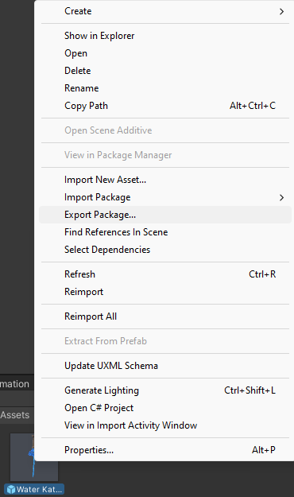

# Integración de Espadas en el Proyecto Final

¡Hola compañeros! A continuación, se detallan los pasos que deben seguir para integrar sus espadas en nuestro proyecto final de manera organizada y eficiente.

## Pasos para Integrar tu Espada

### 1. Proyecto Personal
- En tu proyecto personal, crea un **prefab** de tu espada.
- Crea una carpeta principal para tu espada y dentro de ella, las siguientes subcarpetas: **Materials, Models, Prefabs, Shaders, Textures**.
- Coloca el prefab de tu espada en la carpeta **Prefabs**.

### 2. Exportar UnityPackage
- Haz clic derecho en el prefab de tu espada en la carpeta **Prefabs**.
- Selecciona la opción **Export Package**.
- Una vez exportado el UnityPackage, impórtalo en nuestro proyecto grupal.

### 3. Carpeta en Models/Swords
- En nuestro proyecto grupal, crea una nueva carpeta en **Models/Swords** con tu nombre.
- Dentro de esta carpeta, coloca la carpeta que se importó del UnityPackage.
- Para facilitar la organización, nombra la carpeta que se importo con el nombre de tu espada.

### 4. Escena SampleScene
- Arrastra el prefab de tu espada a la escena **SampleScene**.
- Posiciona la espada en el centro (0,0,0) de la escena.
- Busca la cámara llamada **Sword Camera** y ajusta su posición en el eje Z hasta que la espada se vea bien en la tarjeta.

### 5. Carpeta CardData
- Busca la carpeta **CardData** en el proyecto.
- Crea una carpeta dentro de **CardData** con tu nombre y ábrela.
- Dentro de tu carpeta (por ejemplo, **CardData/SuNombre**), haz clic derecho en **Project**.
- Selecciona la opción **Card** que aparece como si fueras a crear un script.

- Asigna un nombre y completa la información solicitada en la ventana de creación de la tarjeta.
- **Importante**: Recuerda la posición de la cámara con la que tu espada se veía bien y colócala en el campo **Camera Position**.

### 6. Ultimo paso
- Vuelve a la escena **SampleScene**.
- Busca el objeto llamado **[SwordShowcase]** y agrega los objetos que creaste en el paso anterior a la lista de **Card Data**.
